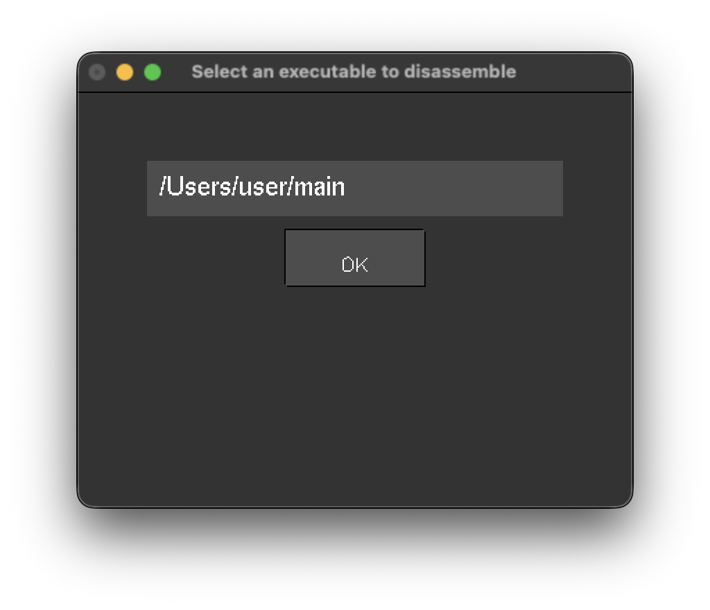
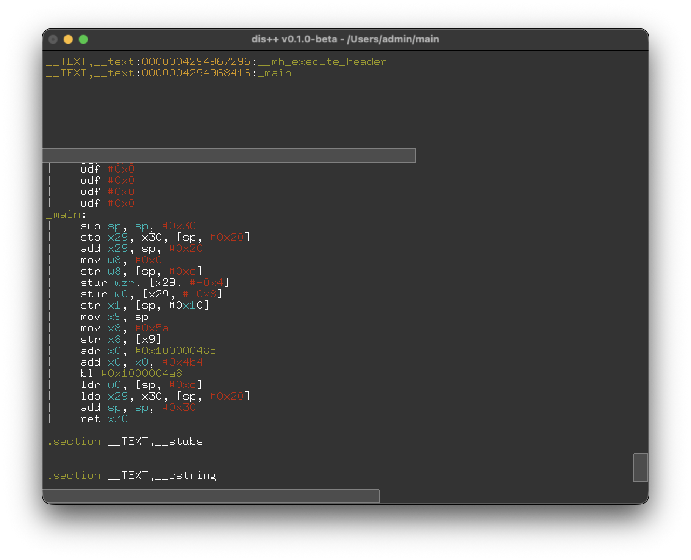

# dis++

<div style="display: flex; gap: 10px;">
  
  
</div>

## Idea of the project

I created the project as a ~~stupid~~, simple, fast and lightweight disassembler
for macOS under M and intel chips. I try to keep project's code in object oriented
style and use the latest C++ versions (now it's C++26).

## Building

The program avaliable on both linux and macOS with 64-bit processors (?)
Just clone this repo, switch to the directory, containing the source and type:
```bash
./mkapp.sh
```

## Code

I almost confident that code contains a HUGE BUNCH of bugs,
maybe because I wrote it under influence of alcohol,
antidepressants, neuroleptics, whatever :p Feel free to
fork the code and improve it. I'd be glad to accept some
help to fix all the bugs!

## License

dis++ is distributed under the terms of both the MIT license and the Apache
License (Version 2.0).
